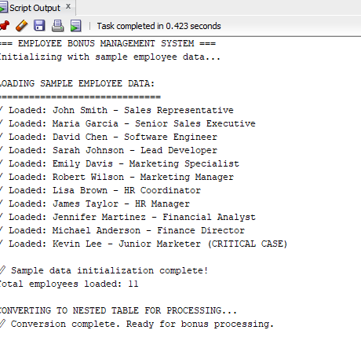
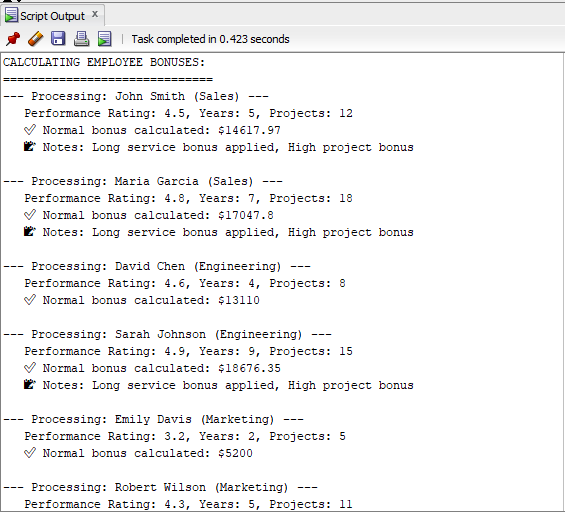
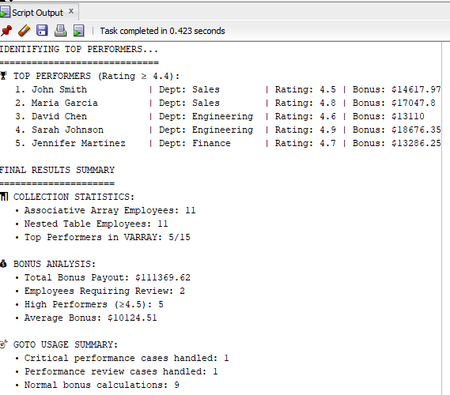

## Names: munezero Cindy
## Student ID: 27120
## Course: Database Development with PL/SQL

# 💼 PL/SQL Employee Bonus Management System

# 💼 PL/SQL Employee Bonus Management System

## 📋 Project Overview
This project demonstrates **advanced PL/SQL programming concepts** through a practical **Employee Bonus Management System**.  
The system calculates employee bonuses based on multiple criteria such as **department performance**, **individual achievements**, and **years of service**.  

The implementation showcases three key PL/SQL features:
- **Collections**
- **Records**
- **GOTO Statements**

All within a real-world business scenario.

---

## 🎯 Problem Statement
### Business Need
Design and implement a comprehensive bonus calculation system that:

- Stores and processes employee data using **PL/SQL collections**
- Maintains structured employee information using **records**
- Handles special performance cases using **controlled GOTO statements**
- Calculates bonuses based on **department**, **performance rating**, **service years**, and **project completion**

---

## 🛠 Tools & Technologies Used
| Component | Description |
|------------|-------------|
| **Database** | Oracle Database 19c |
| **Development Tool** | SQL Developer |
| **Programming Language** | PL/SQL |
| **Concepts Demonstrated** | Collections, Records, GOTO Statements, Control Structures |

---

## 📊 Sample Data
The system includes **11 sample employees** across **5 departments** with varying performance levels:

| Department | ID | Description |
|-------------|----|-------------|
| Sales | 10 | High-performing sales team |
| Engineering | 20 | Technical team with specialized roles |
| Marketing | 30 | Mixed performance levels |
| Human Resources | 40 | Administrative functions |
| Finance | 50 | Financial operations |

---

## 🔧 PL/SQL Implementation Details

### 🧩 Collections Implementation
The system uses all three types of PL/SQL collections:

#### 1. Associative Arrays
```sql
TYPE emp_assoc_array IS TABLE OF emp_record INDEX BY VARCHAR2(100);
v_employees_assoc emp_assoc_array;
```
Purpose: Initial data storage with string-based indexing
Usage: Store employees with keys like 'EMP101', 'EMP102'
Methods Used: COUNT, FIRST, NEXT

#### 2. Nested Tables
```sql
TYPE emp_nested_table IS TABLE OF emp_record;
v_employees_nested emp_nested_table := emp_nested_table();
```
Purpose: Data processing and iteration
Usage: Convert associative array for sequential processing
Methods Used: EXTEND, COUNT

#### 3. VARRAY
```sql
TYPE top_performers_varray IS VARRAY(15) OF emp_record;
v_top_performers top_performers_varray := top_performers_varray();
```
Purpose: Fixed-size collection for top performers
Usage: Store employees with performance rating ≥ 4.4
Methods Used: LIMIT, COUNT, EXTEND

### 🧾 Records Implementation

A comprehensive record structure defines employee data:
```sql
TYPE emp_record IS RECORD (
    employee_id        NUMBER,
    first_name         VARCHAR2(50),
    last_name          VARCHAR2(50),
    department_id      NUMBER,
    department_name    VARCHAR2(50),
    salary             NUMBER,
    performance_rating NUMBER(3,1),
    years_service      NUMBER,
    projects_completed NUMBER,
    bonus_amount       NUMBER,
    bonus_notes        VARCHAR2(100)
);
```
### 🧭 GOTO Statements Implementation

Controlled GOTO usage for performance validation:
```sql
-- Critical performance check
IF v_employees_nested(i).performance_rating < 2.5 THEN
    GOTO critical_performance_issue;
END IF;

-- Low performance check  
IF v_employees_nested(i).performance_rating < 3.0 THEN
    GOTO performance_review_needed;
END IF;

-- GOTO Labels
<<critical_performance_issue>>
<<performance_review_needed>> 
<<normal_bonus_calculation>>
<<bonus_calculation_complete>>
```
### 💰 Bonus Calculation Logic
#### 🏢 Base Bonus Rates by Department
| Department      | Base Bonus |
| --------------- | ---------- |
| Sales           | 15%        |
| Engineering     | 12%        |
| Marketing       | 10%        |
| Human Resources | 8%         |
| Finance         | 11%        |

#### 🌟 Performance Multipliers
| Rating    | Multiplier                |
| --------- | ------------------------- |
| 5.0       | 125%                      |
| 4.0       | 100%                      |
| 3.0       | 75%                       |
| Below 3.0 | Special handling via GOTO |

#### ➕ Additional Bonuses

1. Long Service: +5% per 5 years (capped at 20%)

2. High Projects: +10% bonus for 10+ completed projects

3. Performance Tiers: Different calculation paths based on rating

### 🚀 Execution & Output
#### System Execution Flow

1. Data Initialization: Load sample employees into associative array

2. Collection Conversion: Transform to nested table for processing

3. Bonus Calculation: Process each employee with business rules

4. Top Performers: Identify and store in VARRAY

5. Results Summary: Generate comprehensive reports

#### Sample Output Sections

✅ Employee data loading confirmation

💵 Individual bonus calculation details

⚠️ Performance validation messages

🏆 Top performers list

📈 Collection statistics

📊 Bonus analysis summary

## 🖼 Output Screenshots

#### 1️⃣ Employee Data Loading


#### 2️⃣ Bonus Calculation Details


#### 3️⃣ Top Performers Summary


#### 📈 Business Rules & Validation
### Performance Tiers
| Tier              | Rating Range | Bonus Handling                      |
| ----------------- | ------------ | ----------------------------------- |
| Excellent         | 4.5+         | Full bonus with enhancements        |
| Good              | 4.0–4.4      | Standard bonus calculation          |
| Average           | 3.0–3.9      | Reduced bonus eligibility           |
| Needs Improvement | 2.5–2.9      | Minimal bonus with review required  |
| Critical          | <2.5         | No bonus, immediate action required |

### Validation Rules

1. Department ID validation

2. Performance rating boundaries (1.0–5.0)

3. Salary range checking

4. Service year validation

### 📚 Summary

This Employee Bonus Management System highlights advanced PL/SQL programming techniques by combining structured data (records), complex control logic (GOTO), and dynamic data structures (collections) to build a real-world business solution for automated bonus management.
